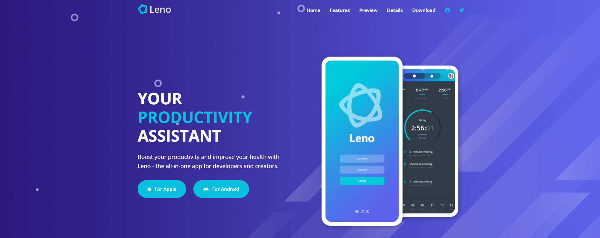

   
    
   

  

    
    
    
  

  <h3 align="center">Leno | Productivity and Health App</h3>

   

     Leno is a website for a fictional mobile app for productivity and health. The project includes multiple pages, with custom animations, and following the BEM convention.
    

